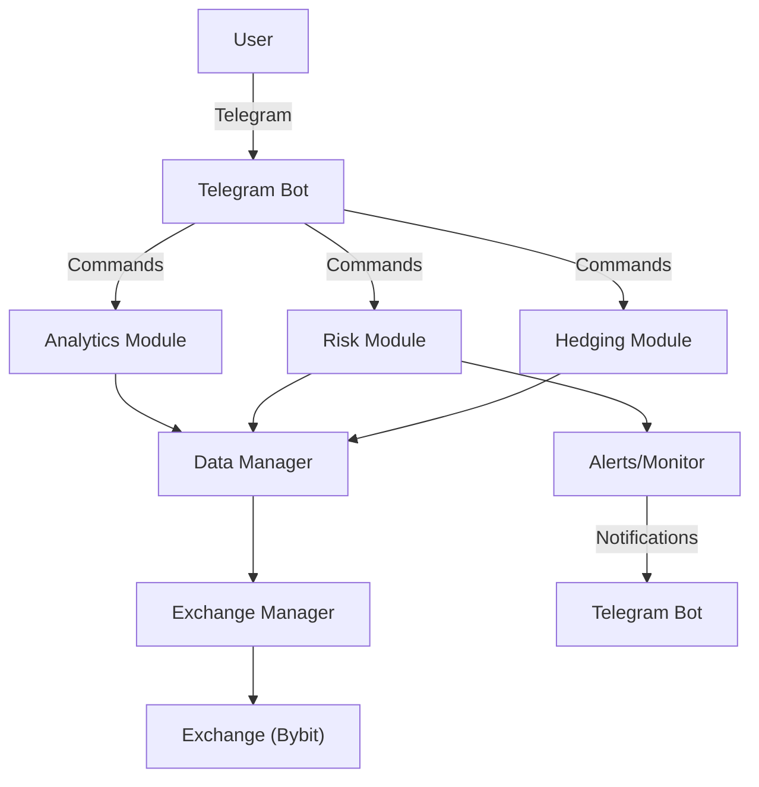

# Crypto Hedging Bot

A sophisticated cryptocurrency hedging bot for Bybit exchange risk management, real-time analytics, and Telegram control interface. Designed for scalable deployment (e.g., PythonAnywhere).

---

## 1. System Architecture

### Overview
The system is modular, with clear separation between data management, analytics, risk, hedging, exchange connectivity, and user interaction via Telegram. All modules interact through well-defined interfaces.



### Components
- **Telegram Bot**: User interface for commands, status, and alerts.
- **Analytics Module**: Generates charts, performance, and portfolio analytics.
- **Risk Module**: Calculates greeks, VaR, stress, and monitors risk limits.
- **Hedging Module**: Executes and manages hedging strategies.
- **Data Manager**: Handles data storage and retrieval.
- **Exchange Manager**: Abstracts Bybit API for trading and data.
- **Alerts/Monitor**: Sends notifications for risk or system events.

---

## 2. API Documentation (Examples)

### Exchange Manager
```python
from exchanges.manager import ExchangeManager
em = ExchangeManager()
order = em.place_order(symbol="BTCUSD", side="buy", qty=1)
```
- **place_order(symbol, side, qty, ...)**: Places an order on Bybit.
- **get_market_data(symbol)**: Returns order book, price, and volatility info.

### Risk Manager
```python
from risk.manager import RiskManager
rm = RiskManager()
greeks = rm.calculate_greeks(symbol="BTCUSD")
```
- **calculate_greeks(symbol)**: Returns delta, gamma, theta, vega for a symbol.
- **monitor_limits()**: Checks if portfolio is within risk limits.

### Telegram Bot
- **/status**: Returns system and portfolio status.
- **/risk**: Shows current risk metrics.
- **/hedge [symbol] [amount]**: Executes a hedge.

---

## 3. Risk Management Methodology
- **Greeks Calculation**: Uses Black-Scholes for delta, gamma, theta, vega (see `risk/greeks.py`).
- **VaR & Stress Testing**: Simulates adverse market moves to estimate potential losses.
- **Risk Limits**: Configurable max delta, gamma, vega, theta. Alerts sent if breached.
- **Automated Hedging**: Triggers hedges when risk exceeds thresholds.

---

## 4. Telegram Bot Command Reference
| Command         | Description                        | Example                |
|-----------------|------------------------------------|------------------------|
| /status         | Show system and portfolio status   | /status                |
| /risk           | Show current risk metrics          | /risk                  |
| /hedge BTCUSD 1 | Hedge 1 BTCUSD                    | /hedge BTCUSD 1        |
| /help           | List available commands            | /help                  |

- **Error Handling**: User-friendly messages for invalid commands or system errors.

---

## 5. Inline Code Comments and Docstrings
- All functions/classes should have docstrings describing purpose, parameters, returns, and exceptions.
- Use inline comments for complex logic.
- Example:
```python
 def calculate_delta(...):
     """Calculate the delta of an option using Black-Schcholes."""
     # Compute d1 for Black-Scholes
     ...
```

---

## 6. Setup and Configuration Guide
1. **Clone the repo and install dependencies:**
   ```sh
   pip install -r requirements.txt
   ```
2. **Create a `.env` file** with your API keys and settings (see below).
3. **Run the bot:**
   ```sh
   python main.py
   ```
4. **Run tests:**
   ```sh
   pytest -v
   ```

### Environment Variables (.env)
- BYBIT_API_KEY, BYBIT_API_SECRET
- TELEGRAM_TOKEN, TELEGRAM_CHAT_ID
- ENVIRONMENT, LOG_LEVEL
- MAX_DELTA, MAX_GAMMA, MAX_VEGA, MAX_THETA

### Troubleshooting
- Ensure all required API keys are set in your environment or .env file.
- For production, set `ENVIRONMENT=production` and adjust `LOG_LEVEL` as needed.
- If you see import errors, check your `PYTHONPATH` and run from the project root.

---

For further details, see inline code comments and module docstrings throughout the codebase. 